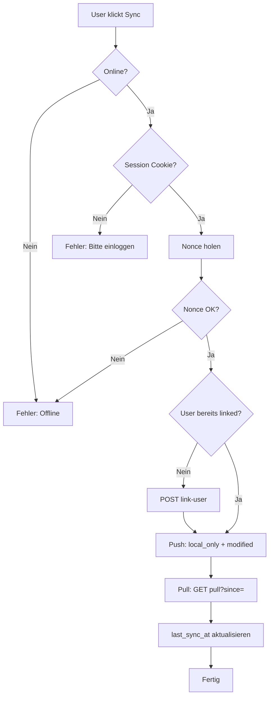

# Offline-First Architektur

## Übersicht

Die App unterstützt einen **Offline-First Modus**, in dem alle Daten lokal in IndexedDB (via Dexie.js) gespeichert werden. Ein lokaler Gastbenutzer arbeitet ohne Login; bei Bedarf wird per Sync-Button mit dem WordPress-Backend synchronisiert.

## Architektur

```
┌─────────────────┐     ┌──────────────────┐     ┌─────────────────┐
│   React/Next    │────▶│   DataService    │────▶│ Online + Auth?  │
│   Components    │     │   (Repository)   │     └────────┬────────┘
└─────────────────┘     └──────────────────┘              │
                                │                    ┌─────┴─────┐
                                │                    ▼           ▼
                                │              ┌─────────┐  ┌──────────┐
                                │              │ WordPress│  │IndexedDB │
                                └──────────────│   API   │  │ (Dexie)  │
                                               └─────────┘  └──────────┘
```

## Nonce & Session im Offline-Kontext

- **WordPress Nonces** sind kurzlebig (ca. 12h) und an eine Session gebunden.
- Nonces werden **niemals** gecacht oder in localStorage gespeichert.
- Im Offline-Modus: Keine Nonce, kein API-Call. Alle Schreiboperationen laufen ausschliesslich gegen IndexedDB.
- Beim Sync: Frische Nonce vom Server (`GET /wp-json/silverline/v1/nonce`), danach sofort für Push/Pull verwendet, nicht gespeichert.

## Sync-Ablauf



## Konfliktlösung

- **Strategie:** Last Write Wins (LWW) basierend auf `local_updated_at` vs. `remote_updated_at`.
- Konflikte werden als `sync_status = 'conflict'` markiert.
- UI: `ConflictQueue`-Komponente listet Konflikte und ermöglicht „Lokale Version behalten“ oder „Remote-Version übernehmen“.

## Testing-Modus

`.env.local`:

```
NEXT_PUBLIC_OFFLINE_MODE=true
```

- Unterdrückt alle API-Calls.
- Erzwingt ausschliesslich IndexedDB.
- Für lokales Testing ohne Backend-Verbindung.

## Implementierungsstand (WIP)

- [x] Dexie-Schema (profile, positions, events)
- [x] Local Guest User (local_user_id in localStorage)
- [x] AuthService (getLocalUserId, getAuthState, fetchFreshNonce, isOfflineMode)
- [x] DataService (loadProfile, saveProfile, loadPositions, savePositions)
- [x] Integration in BaseForm, FinanceClientPage, ForecastClientPage, SummaryClientPage, bootstrapProfileV2
- [ ] SyncService (link-user, push, pull)
- [ ] SyncStatusBadge, SyncButton, ConflictQueue, GuestBanner
- [ ] WordPress Backend: Sync-Endpoints
- [ ] Dev-Overlay „OFFLINE MODE“
