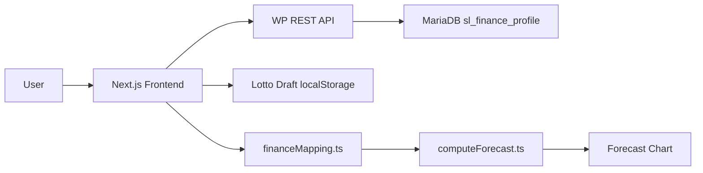
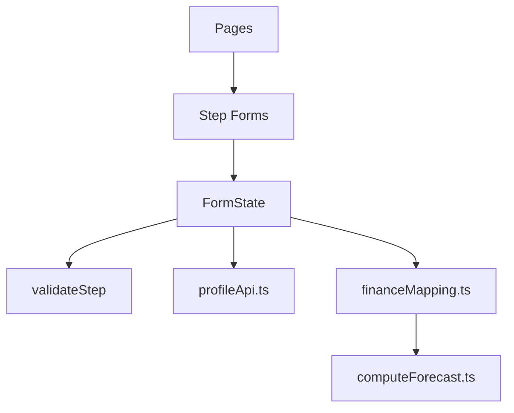
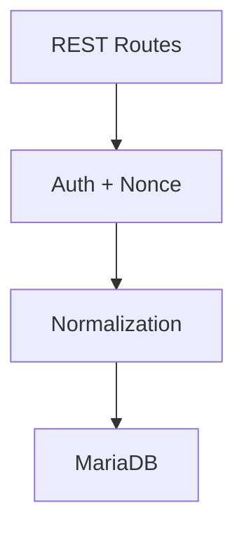

# Silverline – Architekturübersicht

## Zielbild
- **FinWF (Finance-Workflow)** ist die Single Source of Truth für persönliche Finanzdaten.
- **Lotto** ist ein Szenario-Overlay (optional, lokal persistiert).
- **Forecast** ist eine reine Rechen- und Visualisierungsschicht (keine Persistenz).

---

## Systemüberblick (End-to-End)

## Frontend – Verantwortlichkeiten

## Backend – Verantwortlichkeiten

## Neues Feld einführen (Checkliste)

1) Types (StepXData + INITIAL_FORM)
2) UI (StepXForm)
3) Validation (validateStep)
4) DB (ALTER TABLE)
5) PHP Plugin (GET / POST / RESET + Normalizer)
6) Mapping (falls Forecast-relevant)
7) Forecast / Charts
