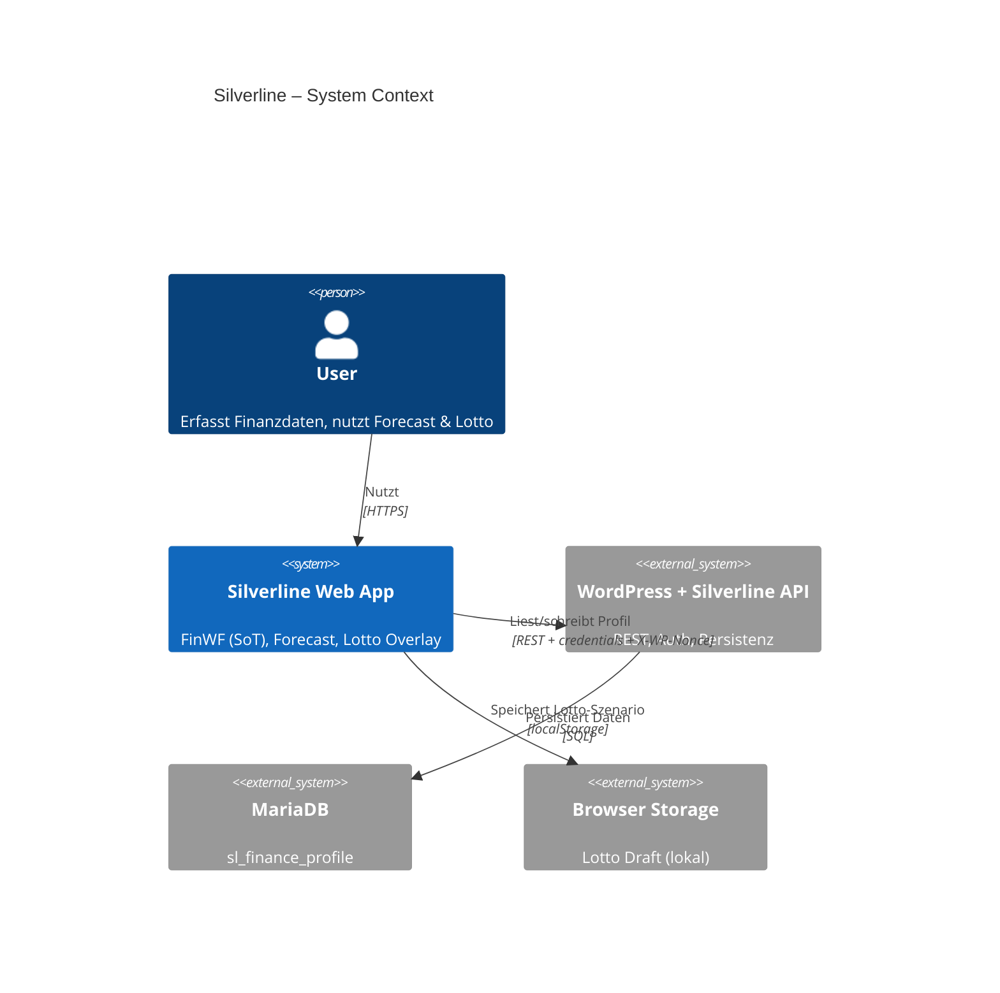
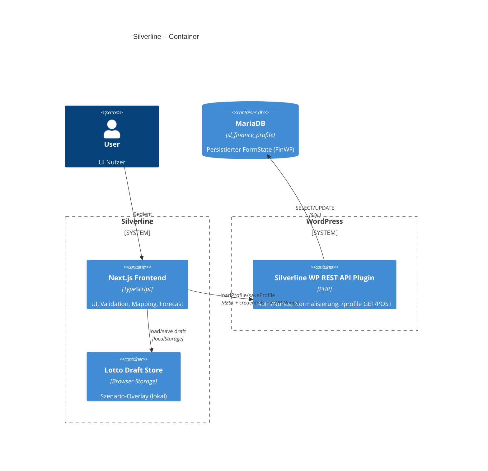
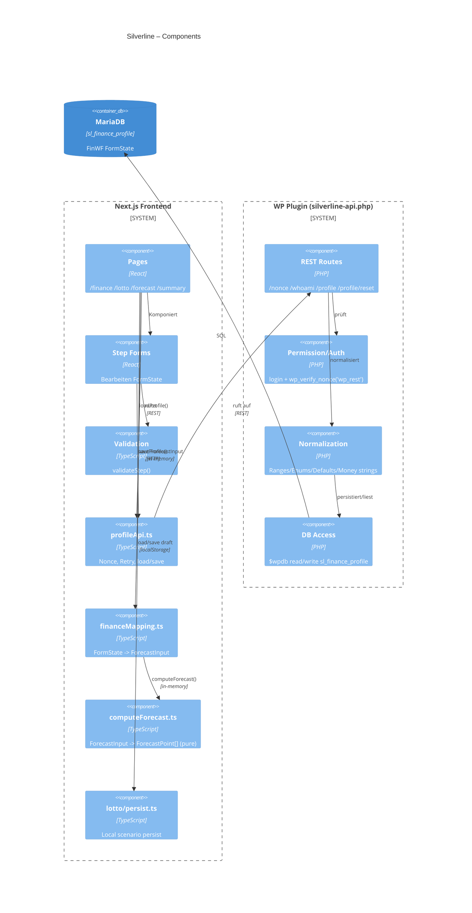

---

## `ARCHITECTURE_C4.md`

```markdown
# Silverline – Architektur
```
---
### Related diagrams
- [Finance Init – UI ready](financeInit.md)
- [Finance Save](financeSave.md)
- [Finance Next (best-effort)](financeNext.md)
---

## Golden rules (must not be broken)

- Single Source of Truth: ProfileV2 (server) + local in-memory copy in /finance.
- Auth: WP cookies + X-WP-Nonce (wp_rest). Some endpoints allow cookie fallback (see API_CONTRACTS.md).
- Forecast engine is pure/deterministic: no IO, no date/time randomness, same input => same output.
- Money: store CHF as integers (no floats). Conversions use trunc/round rule consistently.
- Workflow: "Next" is best-effort (may advance step even if save fails), but must surface saveError.
- Invariants: liquidity must never be negative; debt servicing follows defined source instrument(s). See INVARIANTS.md.

## C4 – Context







### Core docs
- [BUSINESS_RULES](BUSINESS_RULES.md)
- [API Contracts](API_CONTRACTS.md)
- [Key files](KEY_FILES.md)
