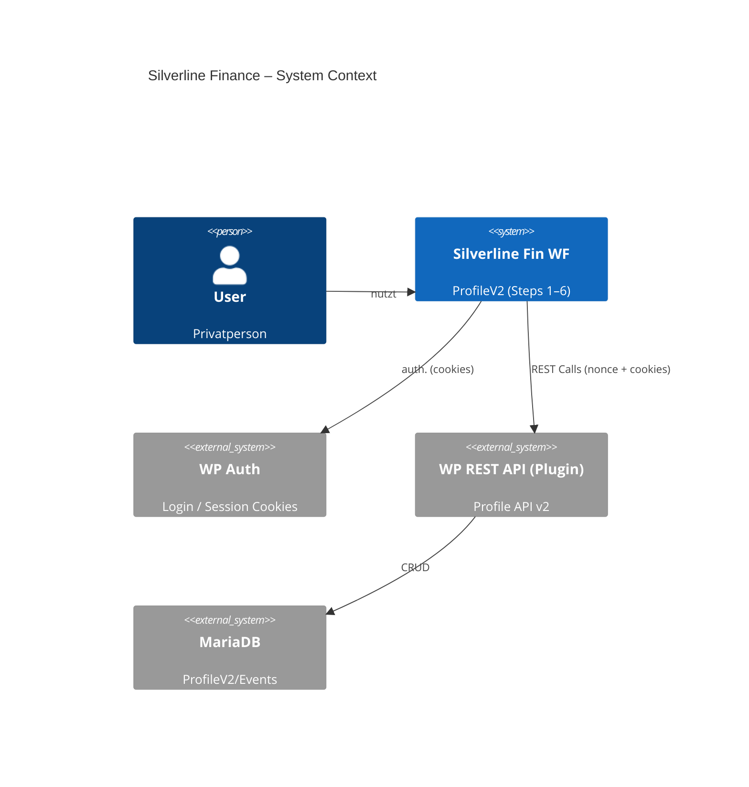
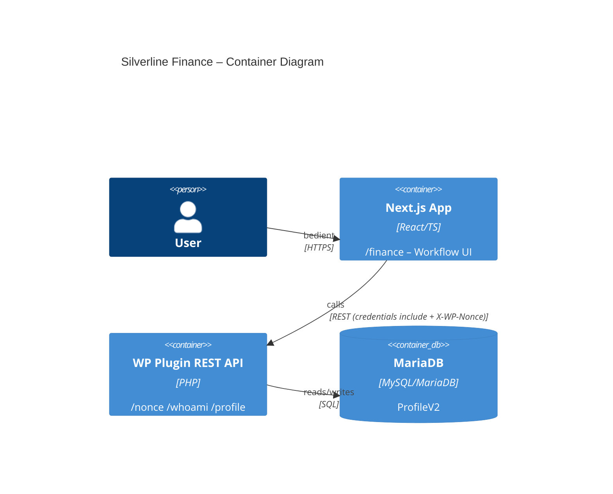
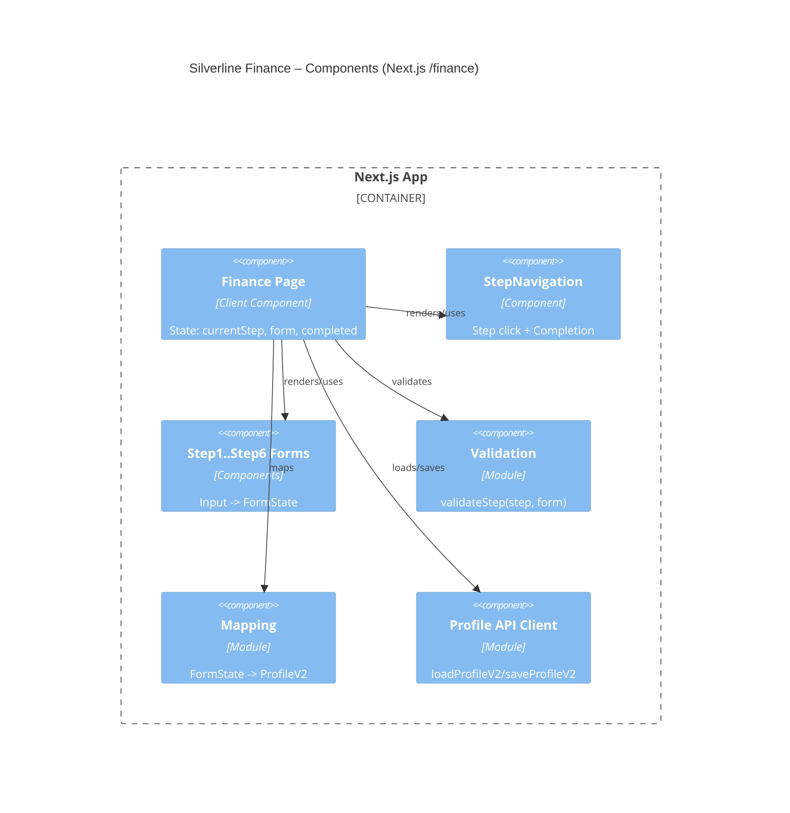
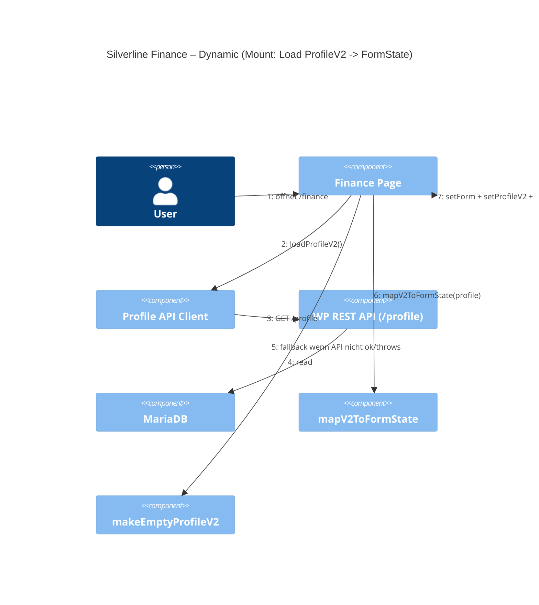
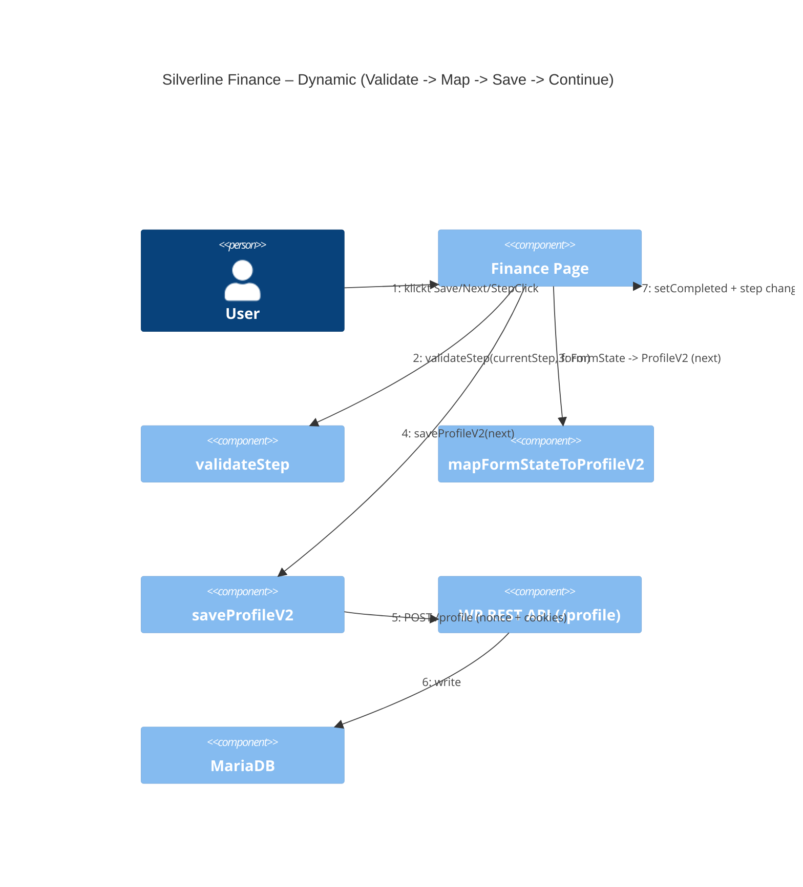

# financeArch.md — Silverline Finance (Architektur)

## 1) Context (C4 – L1)

```mermaid
C4Context
title Silverline Finance – System Context

Person(user, "User", "Privatperson")
System(finance, "Silverline Fin WF", "ProfileV2 (Steps 1–6)")

System_Ext(wpAuth, "WP Auth", "Login / Session Cookies")
System_Ext(wpApi, "WP REST API (Plugin)", "Profile API v2")
System_Ext(db, "MariaDB", "ProfileV2/Events")

Rel(user, finance, "nutzt")
Rel(finance, wpAuth, "auth. (cookies)")
Rel(finance, wpApi, "REST Calls (nonce + cookies)")
Rel(wpApi, db, "CRUD")
```

```mermaid
C4Container
title Silverline Finance – Container Diagram

Person(user, "User")

Container(web, "Next.js App", "React/TS", "/finance – Workflow UI")
Container(api, "WP Plugin REST API", "PHP", "/nonce /whoami /profile")
ContainerDb(db, "MariaDB", "MySQL/MariaDB", "ProfileV2")

Rel(user, web, "bedient", "HTTPS")
Rel(web, api, "calls", "REST (credentials include + X-WP-Nonce)")
Rel(api, db, "reads/writes", "SQL")
```

```mermaid
C4Component
title Silverline Finance – Components (Next.js /finance)

Container_Boundary(web, "Next.js App") {
  Component(page, "Finance Page", "Client Component", "State: currentStep, form, completed")
  Component(nav, "StepNavigation", "Component", "Step click + Completion")
  Component(forms, "Step1..Step6 Forms", "Components", "Input -> FormState")

  Component(validator, "Validation", "Module", "validateStep(step, form)")
  Component(mapping, "Mapping", "Module", "FormState -> ProfileV2")
  Component(apiClient, "Profile API Client", "Module", "loadProfileV2/saveProfileV2")
}

Rel(page, nav, "renders/uses")
Rel(page, forms, "renders/uses")
Rel(page, validator, "validates")
Rel(page, mapping, "maps")
Rel(page, apiClient, "loads/saves")
```

```mermaid
C4Dynamic
title Silverline Finance – Dynamic (Mount: Load ProfileV2 -> FormState)

Person(user, "User")
Component(page, "Finance Page")
Component(apiClient, "Profile API Client")
Component(api, "WP REST API (/profile)")
Component(db, "MariaDB")
Component(map, "mapV2ToFormState")
Component(empty, "makeEmptyProfileV2")

Rel(user, page, "öffnet /finance")
Rel(page, apiClient, "loadProfileV2()")
Rel(apiClient, api, "GET /profile")
Rel(api, db, "read")

Rel(page, empty, "fallback wenn API nicht ok/throws")
Rel(page, map, "mapV2ToFormState(profile)")
Rel(page, page, "setForm + setProfileV2 + setLoading(false)")
```

```mermaid
C4Dynamic
title Silverline Finance – Dynamic (Validate -> Map -> Save -> Continue)

Person(user, "User")
Component(page, "Finance Page")
Component(val, "validateStep")
Component(map, "mapFormStateToProfileV2")
Component(apiClient, "saveProfileV2")
Component(api, "WP REST API (/profile)")
Component(db, "MariaDB")

Rel(user, page, "klickt Save/Next/StepClick")
Rel(page, val, "validateStep(currentStep, form)")

Rel(page, map, "FormState -> ProfileV2 (next)")
Rel(page, apiClient, "saveProfileV2(next)")
Rel(apiClient, api, "POST /profile (nonce + cookies)")
Rel(api, db, "write")

Rel(page, page, "setCompleted + step change (best-effort)")
```