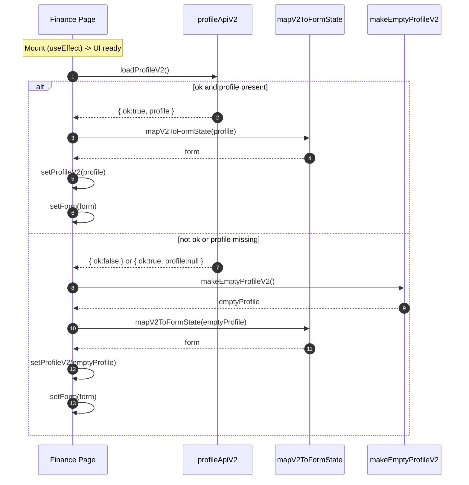

← [Architecture Overview](ARCHITECTURE_C4.md)

# Finance Workflow — Init (UI ready)

**Scope:** Finance Workflow (`/finance`)  
**Purpose:** Initialer Ablauf bis UI bereit für Eingaben  
**Related:** [Save](financeSave.md) · [Next (best-effort)](financeNext.md)

---
## Finance Workflow Sequence of Init

---

⬅️ [Back to Architecture Overview](ARCHITECTURE_C4.md)

**See also**
- [Finance — Init](financeInit.md)
- [Finance — Save](financeSave.md)
- [Finance — Next (best-effort)](financeNext.md)