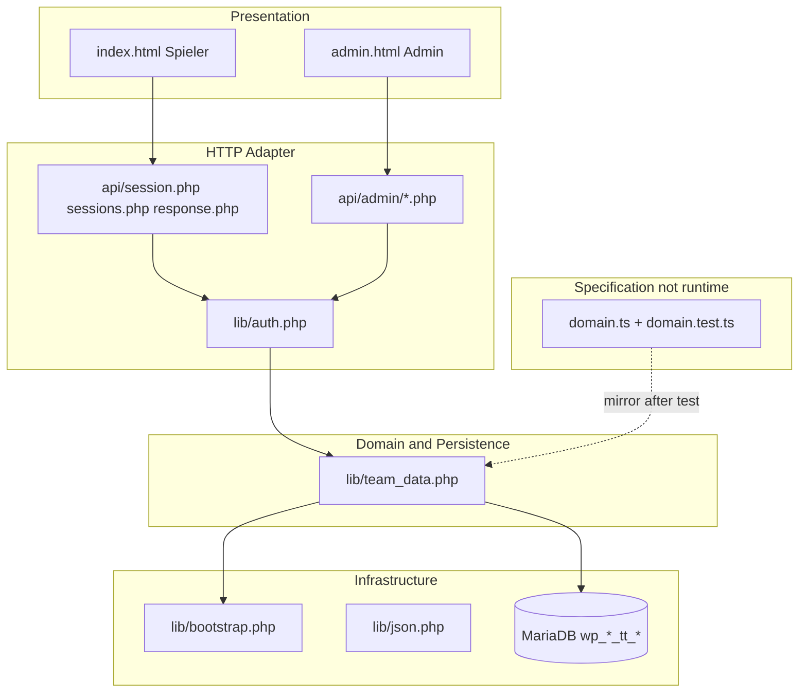
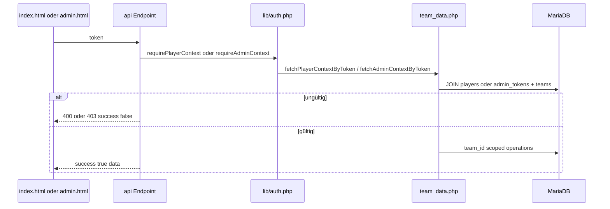

# Tennisteam — Architektur

Technische Referenz für Entwicklung und KI-gestützte Wartung. Produktscope: [V1_SPEC.md](../V1_SPEC.md), Einstieg für Agents: [AGENTS.md](../AGENTS.md).

## Schichtmodell



| Grenze | Soll | Verletzung vermeiden |
|--------|------|----------------------|
| HTTP ↔ Domain | Endpoints dünn; Auth via `lib/auth.php` | Kein SQL in `api/` |
| Domain ↔ DB | Alles in `team_data.php` | Kein SQL in HTML/JS |
| Domain ↔ UI | UI ruft nur API | Keine Business-Regeln inline in HTML |
| Spec ↔ Runtime | `domain.ts` führt, PHP spiegelt | Keine parallelen Regeln in JS |

## Authentifizierung

Kein Passwort-Login. Token in URL (GET) oder JSON-Body (POST).



**Helper** ([lib/auth.php](../lib/auth.php)):

- `requirePlayerContextFromQuery()` — GET Spieler-Endpunkte
- `requireAdminContextFromQuery()` — GET Admin-Endpunkte
- `requirePlayerContextFromJsonBody($pdo, $body)` — POST Spieler
- `requireAdminContextFromJsonBody($pdo, $body)` — POST Admin

## JSON-Envelope

Alle Endpoints (ausser `health.php`):

```json
{ "success": true, "data": { ... } }
{ "success": false, "error": "..." }
```

## Datenmodell

Siehe [sql/schema.sql](../sql/schema.sql). Tabellenprefix zur Laufzeit via `tnTable()` (z. B. `wp_1340630_tt_`).

```
teams ─┬─ players (player_token UNIQUE)
       ├─ admin_tokens (admin_token UNIQUE)
       ├─ seasons
       ├─ sessions (UNIQUE team_id + session_date, optional season_id)
       ├─ responses (UNIQUE session_id + player_id)
       └─ season_player_exclusions (PK season_id + player_id)
```

**Schedule-Cascade:** Session-Felder → Season-Defaults → Team-Defaults (`resolveSessionSchedule` in PHP, gespiegelt in `domain.ts`).

## API-Endpunkte (15)

### Spieler (`api/`)

| Endpoint | Methode | Auth | Zweck |
|----------|---------|------|-------|
| [health.php](../api/health.php) | GET | — | DB-Verbindung und Tabellen-Check |
| [sessions.php](../api/sessions.php) | GET | `?token=` | Saison + alle Sessions mit Summary (Haupt-Einstieg Spieler) |
| [session.php](../api/session.php) | GET | `?token=` | Einzelne Session; optional `session_id` |
| [response.php](../api/response.php) | POST | JSON `token` | Eigene Rückmeldung setzen/löschen |

### Admin (`api/admin/`)

| Endpoint | Methode | Auth | Zweck |
|----------|---------|------|-------|
| [dashboard.php](../api/admin/dashboard.php) | GET | `?token=` | Aggregat: Team, Saisons, Sessions, Roster (Haupt-Einstieg Admin) |
| [session.php](../api/admin/session.php) | GET | `?token=` | Legacy: nächste Session only; UI nutzt `dashboard.php` |
| [session-update.php](../api/admin/session-update.php) | POST | JSON `token` | Session-Felder partial update |
| [session-delete.php](../api/admin/session-delete.php) | POST | JSON `token`, `session_id` | Session löschen |
| [response-save.php](../api/admin/response-save.php) | POST | JSON `token` | Admin setzt Spieler-Rückmeldung |
| [team-save.php](../api/admin/team-save.php) | POST | JSON `token` | Team name/location |
| [season-save.php](../api/admin/season-save.php) | POST | JSON `token` | Saison create/update, optional Session-Generierung |
| [season-delete.php](../api/admin/season-delete.php) | POST | JSON `token`, `season_id` | Saison + Sessions löschen |
| [player-save.php](../api/admin/player-save.php) | POST | JSON `token` | Spieler create/update |
| [player-delete.php](../api/admin/player-delete.php) | POST | JSON `token`, `player_id` | Spieler hard-delete |

## Datenflüsse

### Spieler

1. `index.html?token=…` → `GET api/sessions.php`
2. Session wählen → `GET api/session.php?session_id=…`
3. Rückmeldung → `POST api/response.php`

### Admin

1. `admin.html?token=…` → `GET api/admin/dashboard.php`
2. Mutationen → `team-save`, `season-save`, `player-save`, `session-update`, `response-save`, …

## Domain Single Source of Truth

Neue Business-Regeln in dieser Reihenfolge:

1. [domain.ts](../domain.ts)
2. [domain.test.ts](../domain.test.ts) — `npm run test:run -- htmltools/tennisteam/domain.test.ts`
3. Entsprechende Funktion in [lib/team_data.php](../lib/team_data.php)
4. UI nur über API

Portable Funktionen in `domain.ts`: `summarizeAttendance`, `pickRelevantSession`, `resolveSessionSchedule`, `getSeasonTypeForDate`, `filterSessionsForSeason`, …

## Migrations

SQL-Migrationen in [sql/migrate_*.sql](../sql/): vor Deploy auf Ziel-DB ausführen. Schema-Baseline: [sql/schema.sql](../sql/schema.sql).

## Bekannte technische Schulden

| Thema | Hinweis |
|-------|---------|
| Monolith `team_data.php` | ~1.700 Zeilen; schrittweise aufteilen |
| Monolithische HTML | `index.html`, `admin.html` — shared JS extrahieren (Backlog) |
| Triplicate rules | PHP + TS + inline JS können driften |
| N+1 | `buildSeasonSessionsPayload` — Responses pro Session einzeln |
| Legacy | `api/admin/session.php`, ungenutzte `fetchPublished*` / `shiftFutureSessionsToWeekday` |
| Token in URL | GET-Endpoints — Referrer/Log-Risiko |

## Testing

### Automatisiert (Repo-Root)

| Art | Pfad | Abdeckung |
|-----|------|-----------|
| Domain Unit | [domain.test.ts](../domain.test.ts) | Attendance, Summary, Session-Pick, Season, Schedule |
| E2E mocked | [tests/e2e/tennisteam.spec.ts](../../tests/e2e/tennisteam.spec.ts) | Spieler-UI Smoke |
| E2E mocked | [tests/e2e/tennisteam-admin.spec.ts](../../tests/e2e/tennisteam-admin.spec.ts) | Admin-UI Smoke |

### Manuell — test-api.ps1

[test-api.ps1](../test-api.ps1) — Smoke-Tests gegen Live/Staging-URL.

```powershell
./test-api.ps1 -Action health
./test-api.ps1 -Action sessions
./test-api.ps1 -Action admin-dashboard
./test-api.ps1 -Action invalid-player-token
```

### PHPUnit / Pest — Entscheidung

**Aktuell: nicht eingeführt.** Begründung:

- Hosting ist klassisches PHP ohne Composer-Workflow im Deploy
- Kritische Regeln werden über `domain.ts` + Vitest abgesichert; PHP spiegelt
- API-Smoke über `test-api.ps1` erweitert (siehe Actions oben)

**Später erwägen:** PHPUnit mit SQLite/In-Memory-Fixtures, wenn `team_data.php` aufgeteilt wird oder PHP-Regressionen häufen. Bis dahin: Domain-Tests in TS + manuelle API-Smokes.

### Priorität fehlende Tests

| Prio | Bereich |
|------|---------|
| P0 | PHP: `upsertResponse`, Season-Exclusions, `generateSessionsForSeason` (via TS-Spec + test-api) |
| P1 | Contract-Tests JSON-Envelope |
| P2 | E2E gegen echte PHP+DB (Staging) |

## Referenzen

- [api/README.md](../api/README.md) — Endpoint-Übersicht
- [README.md](../README.md) — Produkt und Betrieb
- Geplante Nutzungsauswertung: Cursor-Plan `spieler-admin_nutzungsauswertung` (noch nicht implementiert)
